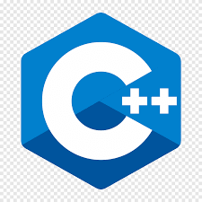
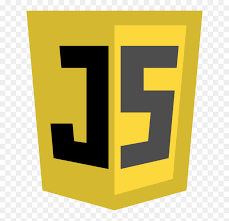
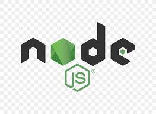

# محمد المعز

## مرحباً 👋

**أنا محمد المعز بابكر. طالب في الصف الأول ثانوي , استخدم لغة سي++ و بايثون و جافا سكريبت.**

 

## المهارات

<table align="center">
  <tr>
    <td align="center" width="96">
       
      <b>C++</b>
    </td>
    <td align="center" width="96">
       
      <b>HTML</b>
    </td>
    <td align="center" width="96">
       
      <b>JavaScript</b>
    </td>
    <td align="center" width="96">
       
      <b>Python</b>
    </td>
  </tr>
  <tr>
    <td align="center" width="96">
       
      <b>Qt</b>
    </td>
    <td align="center" width="96">
       
      <b>Node.js</b>
    </td>
    <td align="center" width="96">
       
      <b>Express</b>
    </td>
    <td align="center" width="96">
       
      <b>uWebSockets</b>
    </td>
  </tr>
</table>

---

## لغات البرمجة والأطر العملية

- **C++**: برمجة الأنظمة والتطبيقات الأداء العالي
- **HTML/CSS**: تطوير واجهات المستخدم
- **JavaScript**: تطوير تطبيقات الويب التفاعلية
- **Python**: البرمجة العامة وتطوير التطبيقات
- **Qt**: تطوير تطبيقات سطح المكتب
- **Node.js**: بيئة تشغيل JavaScript على الخادم
- **Express**: إطار عمل ويب سريع وبسيط للخادم

 

## المشاريع

- تطبيق دردشة (Wansah) ونسة
- إضافة البوتات الى تطبيق ونسة

 

## التواصل

يمكنك التواصل معي عبر:
- GitHub: [MohamedmDgr2010](https://github.com/MohamedmDgr2010)
- Email [almzm0826@gmail.com](mailto://almzm0826@gmail.com)

---

**شكراً لزيارة ملفي الشخصي!** 🫡

